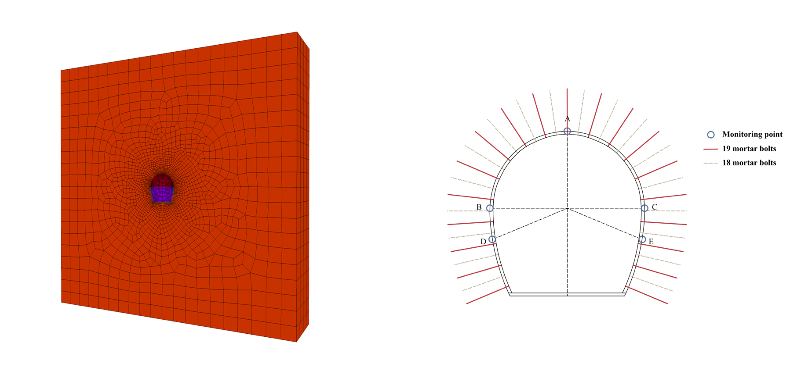
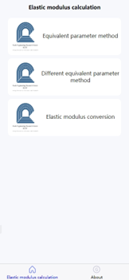
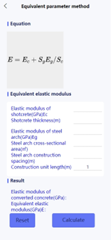

# 2023.Tunnel_surrounding_rock_parameter_inversion


  <h3 align="center">Introduce</h3>
  <p text-indent:14px>
      &nbsp;&nbsp;&nbsp;&nbsp;&nbsp;&nbsp;The project is " Composite Interpretability Optimization Ensemble Learning Inversion Surrounding Rock Mechanical Parameters and Support Optimization in Soft Rock Tunnels " this research paper open data, numerical model, algorithm model, tunnel support elastic modulus calculation tool APP installation package.
      <br />
      &nbsp;&nbsp;&nbsp;&nbsp;&nbsp;&nbsp;The data folder contains the simulation result files of sampling data, the inversion simulation results of real displacement data, and the support optimization simulation results of orthogonal experiments.
      <br />
      &nbsp;&nbsp;&nbsp;&nbsp;&nbsp;&nbsp;The algorithm mode folder contains the training and integration files for the algorithm model.
      <br />
      &nbsp;&nbsp;&nbsp;&nbsp;&nbsp;&nbsp;The numerical model folder contains the bolt models of 5 lengths and 2 layouts of upper and lower layers and the pre-built tunnel mesh model.
      <br />
    <br />
  </p>
<p align="center">
    
    
    
</p>


## Directory

- [File Directory Description](#FileDirectoryDescription)
- [Author](#Author)

<br/>

### File Directory Description
eg:

```
filetree 
├── algorithm mode
│  ├── main.py
├── numerical model
│  ├── cableb41.dxf
│  ├── cableb42.dxf
│  ├── cableb51.dxf
│  ├── cableb52.dxf
│  ├── cableb61.dxf
│  ├── cableb62.dxf
│  ├── cableb71.dxf
│  ├── cableb72.dxf
│  ├── cableb81.dxf
│  ├── cableb82.dxf
│  ├── cablet41.dxf
│  ├── cablet42.dxf
│  ├── cablet51.dxf
│  ├── cablet52.dxf
│  ├── cablet61.dxf
│  ├── cablet62.dxf
│  ├── cablet71.dxf
│  ├── cablet72.dxf
│  ├── cablet81.dxf
│  ├── cablet82.dxf
│  ├── tunnel23.4.11_GVol_Binary.f3grid
├── data
│  ├── sampdata.xlsx
│  ├── realdata.xlsx
│  ├── optdata.xlsx
├── Tunnel support elastic modulus calculation tool.apk
├── README.md

```


### Author

Jingqi Cui
